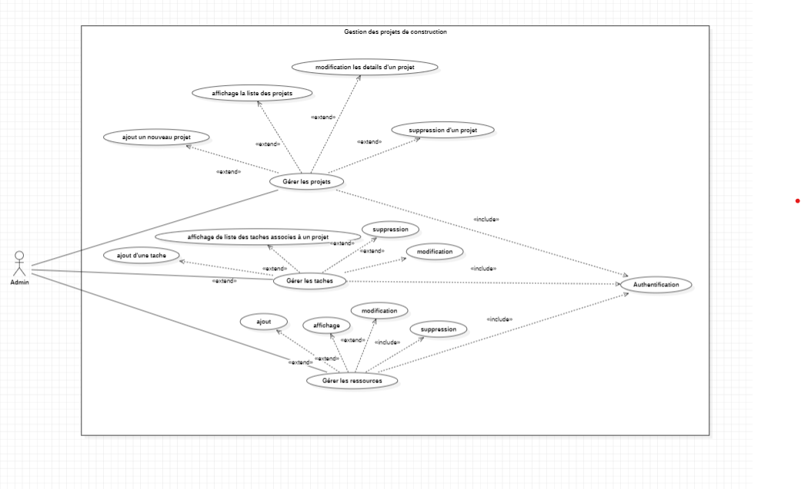
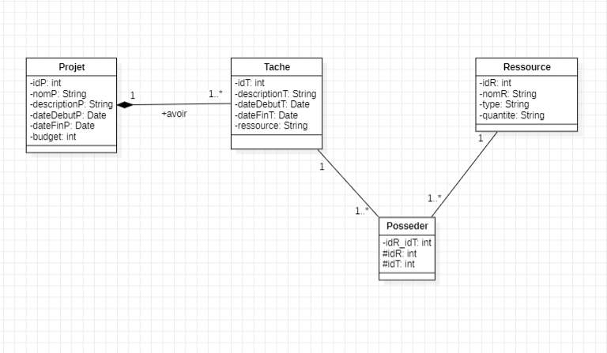
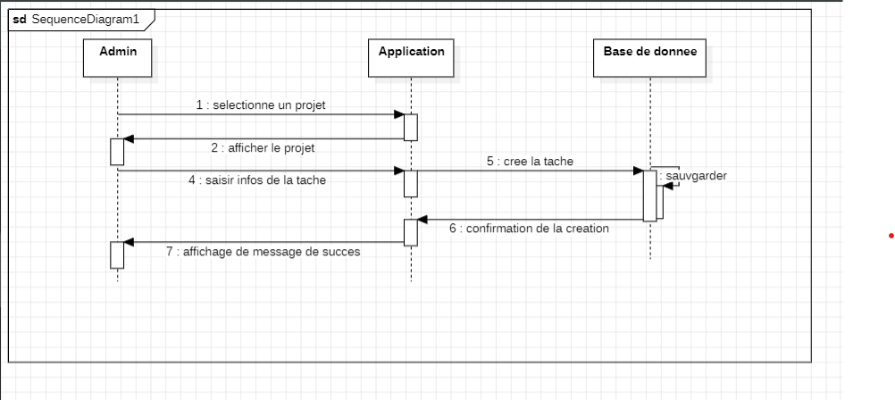
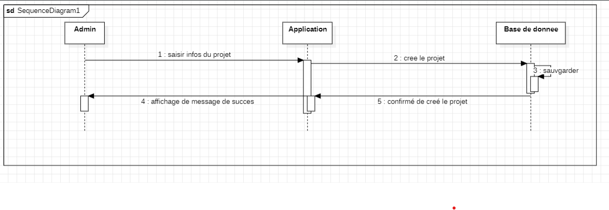

# ConstructionXpert Services - Application de Gestion de Projets de Construction

## Description du Projet

**ConstructionXpert Services** est une application web conçue pour aider les équipes de construction à gérer efficacement leurs projets. Elle permet de créer, organiser, et suivre les projets de construction, d'assigner des tâches aux membres de l'équipe, et de gérer les ressources nécessaires. L'application offre une interface conviviale pour visualiser, mettre à jour, et supprimer des projets et des tâches.

## Contexte du Projet

En tant que développeur full stack freelancer, j'ai été sollicité pour créer cette application pour l'entreprise **ConstructionXpert Services**. L'objectif est de fournir un outil efficace pour planifier et organiser les projets de construction.

---

## Fonctionnalités

### Gestion des Projets
- **Créer un nouveau projet** : Spécifier le nom, la description, la date de début, la date de fin, et le budget.
- **Afficher la liste des projets** : Visualiser les détails des projets existants.
- **Mettre à jour un projet** : Modifier les détails d'un projet existant.
- **Supprimer un projet** : Supprimer un projet de la base de données.

### Gestion des Tâches
- **Créer une nouvelle tâche** : Spécifier la description, la date de début, la date de fin, et les ressources nécessaires.
- **Afficher les tâches** : Visualiser les tâches associées à un projet.
- **Mettre à jour une tâche** : Modifier les détails d'une tâche existante.
- **Supprimer une tâche** : Supprimer une tâche de la base de données.

### Gestion des Ressources
- **Ajouter une ressource** : Spécifier le nom, le type, la quantité, et les informations du fournisseur.
- **Afficher les ressources** : Visualiser les ressources disponibles.
- **Mettre à jour une ressource** : Modifier les détails d'une ressource existante.
- **Supprimer une ressource** : Supprimer une ressource de la base de données.
- **Mettre à jour la quantité** : Ajuster la quantité après chaque assignation à une tâche.

---

## Conception

### Diagrammes UML
- **Diagramme de Classes** : [Lien vers l'image]()
- **Diagramme de Cas d'Utilisation** : [Lien vers l'image]()
- **Diagramme de Séquence** : [Lien vers l'image](#)

---

## Technologies Utilisées

- **Langage de Programmation** : Java
- **Framework Web** : Java EE (Servlets, JSP)
- **Base de Données** : MySQL/PostgreSQL
- **API** : JDBC pour la communication avec la base de données
- **Serveur d'Application** : Apache Tomcat
- **Front-end** : HTML, CSS (Bootstrap/Tailwind), JavaScript
- **Maquette** : Figma/Adobe XD
- **Gestion de Versions** : Git
**1-Diagramme cas d'utilisation:**

**2-Diagramme de classe:**

**3-Diagramme de séquance:**

